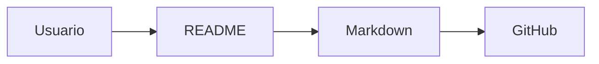

# Laboratorio README

Proyecto de práctica para aprender Markdown avanzado en GitHub.

## Tabla de contenidos

- [Descripción](#descripción)
- [Instalación](#instalación)
- [Uso](#uso)
- [Estado de funcionalidades](#estado-de-funcionalidades)
- [Pendientes](#pendientes)
- [Arquitectura](#arquitectura)
- [Contribuidores](#contribuidores)

## Descripción

Este repositorio documenta mi aprendizaje de Markdown avanzado en GitHub.

Incluye ejemplos de tablas, listas de tareas, badges y diagramas Mermaid para practicar la creación de documentación clara y organizada.


## Instalación

Para obtener el repositorio en tu computadora, utiliza los siguientes comandos:

```bash
git clone https://github.com/dniel-07/laboratorio-readme.git
cd laboratorio-readme
```

## Uso

Este proyecto se utiliza como material de práctica para aprender a crear y organizar documentación en archivos README.

Para visualizar correctamente todos los elementos, abre el archivo `README.md` desde GitHub.

## Estado de funcionalidades

| Función | Estado |
|---|---|
| Tablas | Listo |
| Listas de tareas | Listo |
| Badges | Listo |
| Diagramas Mermaid | Listo |
| Tabla de contenidos | Listo |
| Documentación de instalación | Listo |

## Pendientes

- [x] Diseño de la base de datos
- [ ] Pruebas unitarias

## Arquitectura

El proyecto utiliza una estructura sencilla para representar la relación entre el usuario, el contenido del proyecto y el repositorio de GitHub.



## Contribuidores

| Nombre | Usuario de GitHub |
|---|---|
| TU-NOMBRE | [@dniel-07](https://github.com/dniel-07) |
